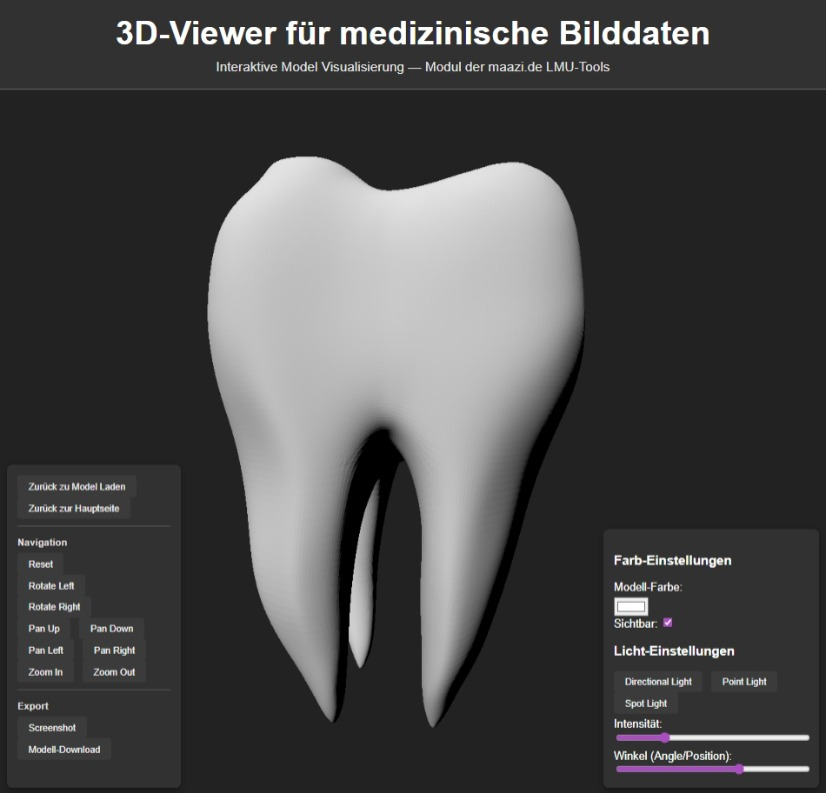
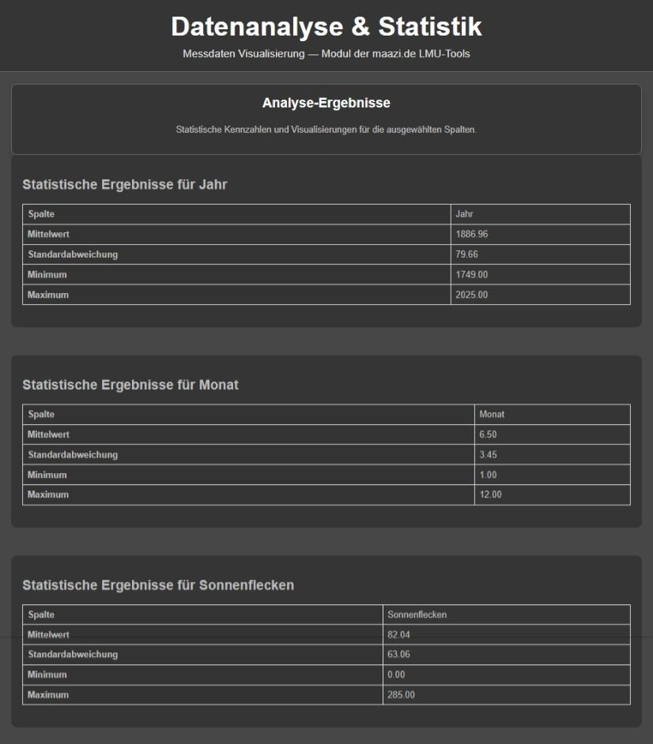
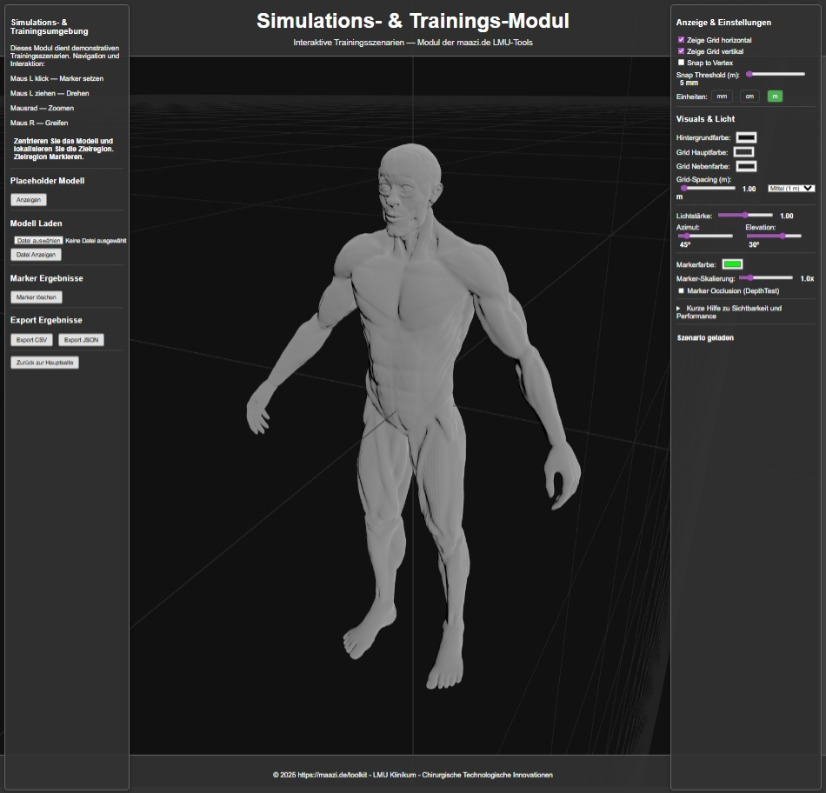
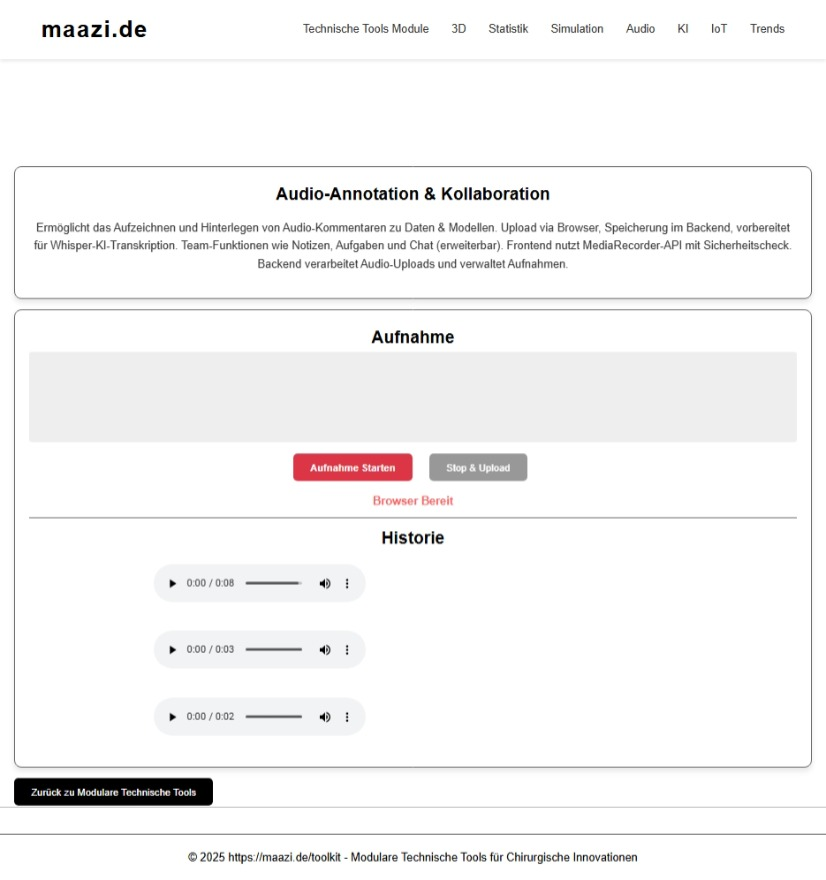
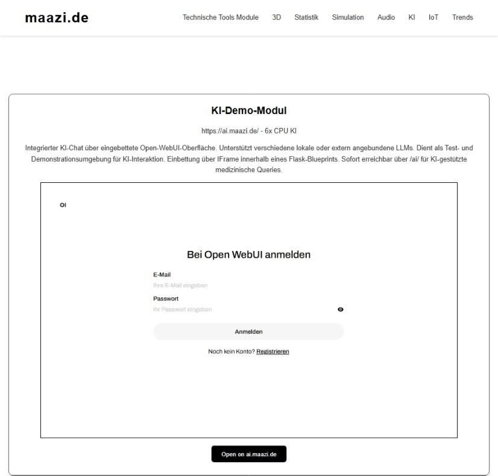
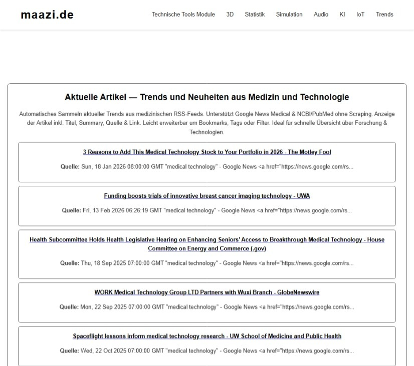
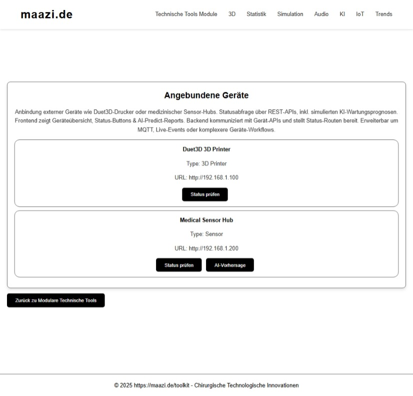

# maazi.de:5000 - Modulare Technische Tools

Dieses Projekt ist eine Sammlung modularer webbasierter Tools für den Bereich "Chirurgische Technologische Innovationen" am Klinikum. Es dient als Bewerbungsprojekt für die Informatiker-Stelle und demonstriert vielseitige Fähigkeiten im Bereich Web-Entwicklung, 3D-Visualisierung, Datenanalyse und mehr.

### VENV ! install ! Virtual Envirement

```bash
python3 -m venv venv

```

DWenn du bereits ein venv hast in `~/maazi_de/venv` , aktiviere es und installiere darin:

```bash
cd ~/maazi_de
source venv/bin/activate
pip install -r requirements.txt
```

Nach der Installation starte die App mit:

```bash
source venv/bin/activate
python app.py
```

###

## Projektstruktur

Ein modulares, webbasiertes Tool, das auf deinem VPS o. ä. (Ubuntu + Plesk) läuft und als Demo auf webseite.de:5000 erreichbar ist. Das Tool soll verschiedene Module (Plug-ins) aufnehmen können, die jeweils eine Funktion aus dem Bereich „Chirurgische Technologische Innovationen“ abbilden. Die Module können leicht erweitert oder angepasst werden.

Technische Umsetzung
Backend: Python (z. B. Flask, FastAPI) oder Node.js, modular aufgebaut
Frontend: Web-GUI mit React, Vue.js oder einfachem HTML/JS, Fokus auf Erweiterbarkeit
Deployment: Auf deinem VPS, erreichbar unter webseite.de:5000
Modularität: Jedes Modul als eigenständiges Plug-in, leicht zu ergänzen oder zu deaktivieren
Dokumentation: Kurze Anleitung, wie neue Module hinzugefügt werden können

---

---

## Plan

## Modulares Web-Tool für chirurgische Innovationen

Meine ToDo-Label info (Marker)!:
[offen] = ist noch zu erledigen
[offen/low-pio] = kann erledigt werden
[anpassen] = ist noch anzupassen
[erledigt] = ist erledigt
[erledigt] = funktioniert schon ganz gut

1. 3D-Viewer für medizinische Bilddaten (1_3d_viewer) [[erledigt]: funktioniert schon ganz gut]

- Das 3D-Viewer-Modul als eigenständiges Plug-in
- Visualisierung von CT/MRT-Daten (DICOM, STL, OBJ)
- Unterstützung für medizinische Formate (DICOM → STL-Konvertierung)
- Interaktive Ansicht: Drehen, Zoomen, Layer ein-/ausblenden
- Möglichkeit, eigene Modelle einzuladen (z. B. aus 3D-Druck) hochzuladen
- Erweiterbar für VR/AR-Ansichten (z. B. WebXR-Integration) [offen/low-pio]
- Annotationen (Text/Audio zu bestimmten Bereichen) [offen/low-pio]
- Exportfunktion (z. B. Screenshot, Modell-Download)
- wie weitere Module ergänzt werden können (z. B. Datenanalyse, KI-Demo) [offen/low-pio]

Funktion / Ordner und Dateistruktur:
Flask-App (Backend):
**app.py** ermöglicht Datei-Upload (STL/OBJ) und zeigt das Modell im Viewer an.
Templates liegen im Ordner `templates/`.
Statische Dateien (Modelle) liegen in `static/uploads/`.

Frontend (Viewer):
**index.html:** Upload-Formular für 3D-Modelle.
**viewer.html:** Anzeige des 3D-Modells mit Three.js und OrbitControls (Drehen/Zoomen).
STL und OBJ Modell wird nach Upload korrekt angezeigt.



---

2. Datenanalyse & Statistik-Modul (2_data_analysis) [[erledigt]: funktioniert schon ganz gut]

- Einfache Auswertung und Visualisierung von Messdaten (z. B. Sensorik, Wafer-Prober, medizinische Geräte)
- Statistische Grundfunktionen: Mittelwert, Standardabweichung, Histogramme
- Exportfunktion für Ergebnisse.

Funktion / Ordner und Dateistruktur:
Backend (Flask, Python):
**app.py** Datei-Upload für Messdaten (CSV, XLSX)
Daten einlesen und analysieren (z. B. mit Pandas, NumPy)
Statistische Kennzahlen berechnen (Mittelwert, Standardabweichung)
Visualisierung erzeugen (Histogramm, Boxplot, ggf. mit Matplotlib/Plotly)
Ergebnisse als Bild/CSV exportieren.

Frontend (HTML/JS):
**index.html:** Upload-Formular für Messdaten
Auswahl der Analysefunktionen (Checkboxen: Mittelwert, Histogramm etc.)
Button „Analyse starten“.
**results.html** Anzeige der berechneten Kennzahlen
Anzeige der Diagramme (als Bild oder interaktiv)
Download-Link für Ergebnisse.



---

3. Simulations- und Trainings-Modul (3_sim_and_train) [[erledigt]: funktioniert schon ganz gut]
   Interaktive Simulation chirurgischer Abläufe oder Trainingsszenarien
   Integration von VR/AR für realitätsnahe Übungen
   Fortschritts- und Leistungsanalyse

   **Grundfunktionen**

- Browserbasierte Mikrosimulation chirurgischer Schritte (z. B. Positionieren, Markieren, Navigieren).
- Darstellung einfacher anatomischer Strukturen (z. B. generische Organe, Knochenmodelle, Gefäße).
- Simulation von Abläufen durch Schritt-für-Schritt-Workflow:
  - Vorbereitung
  - Interaktion (z. B. Werkzeug → Anatomie)
  - Abschluss/Ergebnisdarstellung
- UI-Elemente zur Auswahl des Szenarios (Dropdown: „Modell“, „Instrument“, „Ablaufvariante“).

**Interaktionskonzept**

- Maus-/Touch-Steuerung im Browser (Rotation, Auswahl, Drag & Drop).
- Optional: Integration von WebXR für VR-Brillen (Meta Quest, HTC Vive, etc.).
- Abstrakte Interaktion mit chirurgischen Werkzeugen:
  - Punktmarkierung
  - Linienzug
  - Objektmanipulation
  - Werkzeugpfadsimulation

**Trainings- und Bewertungslogik**

- Logging von Nutzeraktionen (Zeit, Reihenfolge, Genauigkeit).
- Kennzahlen:
  - Zeit pro Schritt
  - Abweichung vom Soll-Pfad / Soll-Punkt
  - Fehlerquote (Ausreißer, Fehlplatzierungen)
- Automatisch generierter Ergebnisbericht (JSON + HTML-Ansicht).
- Exportfunktion:
  - CSV für Trainingsdaten
  - PNG für Screenshots

**Erweiterbarkeit**

- Jedes Szenario als eigenständige JSON-Konfigurationsdatei:
  - Anatomische Modelle
  - Werkzeuge
  - Workflow-Schritte
  - Bewertungskriterien
- Plug-in-Struktur für neue Interaktionen oder Szenarien (z. B. Endoskopie, Katheterführung, Navigationshilfe).
- Optionale Schnittstelle (REST-API) für Integration mit Gerätedaten oder Sensoren (z. B. Tracking-Systeme).



---

4. Audio-Annotation & Kollaboration (4_audio_anno_chat) [offen]
   Audio-Kommentare zu Forschungsdaten oder Bildern hinterlegen
   Gemeinsames Arbeiten: Notizen, Aufgabenverwaltung, Chatfunktion
   Schnittstelle für Teammitglieder

   **Python Backend Funktionen:**
   Route /: Rendert die Haupt-GUI (index.html), listet bisherige Aufnahmen auf.
   Route /upload (POST):
   Nimmt das Audio-Blob vom Browser entgegen (request.files).
   Speichert es mit Zeitstempel im Ordner static/uploads.
   Trigger (zukünftig): Ruft die Funktion run_whisper_ai(filepath) auf.
   KI-Integration: Der Platzhalter (simulated_transkript) zeigt die zukünftige Integration des OpenAI Whisper Models (oder einer ähnlichen lokalen KI) zur automatischen Spracherkennung.

   **JavaScript Frontend Funktionen:**
   Sicherheitscheck: Prüft, ob navigator.mediaDevices.getUserMedia vorhanden ist (HTTPS/localhost erforderlich) und gibt bei Blockierung eine aussagekräftige Fehlermeldung aus.
   Aufnahme: Nutzt die native MediaRecorder API, um das Mikrofon-Signal als audioBlob zu speichern.
   Upload: Sendet das audioBlob über fetch als FormData an das Flask-Backend (/upload).



---

5. KI-Demo-Modul (5_ai) [[erledigt]: funktioniert schon ganz gut]
   KI-Chatbot mit integrierten Modellen für Fragen und Antworten, Demonstration von KI-Interaktion.
   Integration eines externen Open-WebUI für verschiedene LLM Modelle zur Demonstration von KI-Sprachmodellen.

Funktion / Ordner und Dateistruktur:
Flask-App (Backend):
**app.py** Blueprint für KI-Modul, rendert IFrame zu externer Open-WebUI (maazi.de:3000).
Templates liegen in `../templates/`.

Frontend (HTML):
**ai_index.html:** IFrame-Embedding der Open-WebUI für interaktive KI-Chats mit verschiedenen Modellen (z. B. OpenAI-like Interfaces).
Demonstriert Integration und Handling von KI-Services für medizinische Queries.

Integration: Erreichbar unter `/ai/`, zeigt direkt die KI-Interface für Test und Demo-Zwecke.



---

6. Entdeckermodul für neue Themen (6_wiki_trends) [[erledigt]: funktioniert ganz gut]
   Automatisches Sammeln und Anzeigen von Trends aus RSS-Feeds zu medizinischer Technologie und Forschung.
   Integration von Google News und NCBI RSS-Feeds für aktuelle Entwicklungen ohne Scraping.

Funktion / Ordner und Dateistruktur:
Flask-App (Backend):
**app.py** Blueprint, fetcht Artikel aus RSS-Feeds (Google News Medical, NCBI PubMed).
Verwendet feedparser für sichere RSS-Parsing.
Templates liegen in `../templates/`.

Frontend (HTML):
**wiki_index.html:** Liste der aktuellen Artikel mit Titel, Summary, Quelle und Links.
Automatische Aktualisierung bei Laden zur Demonstration von Trend-Monitoring.

Features: Erlaubt Erweiterung um Favoriten/Bookmarks (zukünftig), Tags basierend auf Quelle.
Integration: Erreichbar unter `/wiki/`, für Üblem als Ressource für neue Technologien und Trends im Bereich Chirurgische Innovationen.



---

7. Schnittstellen-Modul (7_com) [[erledigt]: funktioniert ganz gut]
   Anbindung an externe Geräte (z. B. Duet3D 3D-Drucker) und medizinische Sensoren via APIs.
   Demonstration von IoT-Integration für Geräte-Statusabfrage und AI-basierte Vorhersagen für Wartung.

   **Geräte-Unterstützung**

- Duet3D WLAN 3D-Drucker: Status via RepRap Firmware API (/rr_status).
- Medizinische Sensor-Hubs: Platzhalter für REST-API, mit simulierten AI-Predict für Preventive Maintenance.

Funktion / Ordner und Dateistruktur:
Flask-App (Backend):
**app.py** Blueprint mit Devices-Liste, Status-API-Endpunkte für HTTP requests zu Geräten.
Templates liegen in `../templates/`.
AI-Predict Route für simulierten KI-Wartungsempfehlungen (z. B. für Sensoren).

Frontend (HTML/JS):
**com_index.html:** Liste der Geräte mit Status-Buttons und AI-Predict.
JavaScript für fetch() API calls zur Geräte-Statusabfrage und KI-Bericht.

Integration: Erreichbar unter `/com/`, zeigt IoT-Konnektivität und erste AI-Integration für Geräte-Management.

**API-Integration Features:**

- REST-API für Geräte-Status und steuerung.
- Erweiterbar für MQTT für Real-time Events, als Demo für Forschungs- und Geräte-Kollektion-Integration.



---

---

## Server & Ordnerstruktur

- VPS mit Ubuntu und Plesk, erreichbar unter `webseite.de:5000`
- Projektstruktur:
  ~/webseite_de/
  main.py [[anpassen]: Haupt Landingpage, Menü zu allen Modulen, funktioniert schon ganz gut, weitere Module Erstellen und einbinden]
│
├─ 1_3d_viewer/ [[erledigt]: funktioniert schon ganz gut]
│ ├─ app.py
│ │
│ ├─ templates/
│ │ ├─ index.html
│ │ └─ viewer.html
│ ├─ static/
│ └─ uploads/
│
├─ 2_data_analysis/ [[erledigt]: funktioniert schon ganz gut]
│ ├─ app.py
│ │
│ ├─ templates/
│ │ ├─ index.html
│ │ └─ results.html
│ │
│ └─ static/
│ ├─ uploads/
│ └─ plots/
│
├─ 3_sim_and_train/ [[erledigt]: funktioniert schon ganz gut]
│ ├─ app.py
│ │
│ ├─ scenarios/
│ │ ├─ baseline_demo.json
│ │ ├─ liver_basic.json
│ │ └─ training_paths.json
│ │
│ ├─ static/
│ │ ├─ models/
│ │ │ └─ placeholder_model.glb
│ │ │
│ │ ├─ js/
│ │ │ ├─ sceneLoader.js
│ │ │ ├─ interaction.js
│ │ │ ├─ workflow.js
│ │ │ └─ metrics.js
│ │ │
│ │ └─ css/
│ │ └─ style.css
│ │
│ └─ templates/
│ ├─ index.html
│ ├─ simulator.html
│ └─ results.html
│  
 ├─ 4_audio_anno_chat/ [[erledigt]: funktioniert schon ganz gut]
│ │
│ ├── main_app.py # (Optional) Haupt-Einstiegspunkt für alle Module
│ │
│ ├── 1_data_upload_and_analysis/ # [Modul 1: Datenanalyse & Upload]
│ │ ├─ app.py # Logik für Upload und statistische Auswertung
│ │ └─ ...
│ │
│ ├── 2_model_evaluation/ # [Modul 2: Modell-Evaluation]
│ │ ├─ app.py # Logik für Metriken und Modell-Vergleich
│ │ └─ ...
│ │
│ ├── 3_sim_and_train/ # [Modul 3: Simulation & Training]
│ │ ├─ app.py # Logik für 3D-Ladeszenarien und Metrik-Erfassung
│ │ ├─ scenarios/ # JSON-Konfigurationen für Simulationen
│ │ ├─ static/
│ │ │ └─ models/ # 3D-Modelle (.glb) für die Simulation
│ │ └─ ...
│ │
│ └── 4_audio_anno_chat/ # [Modul 4: Audio-Annotation & Kollaboration]
│ ├─ app.py # Flask Backend (Upload, Dateiverwaltung & KI-Trigger)
│ │
│ ├─ requirements.txt # Flask, Whisper (für KI)
│ │
│ ├─ static/ # Frontend-Assets
│ │ ├─ uploads/ # Gespeicherte Audio-Dateien (.webm/.wav)
│ │ ├─ css/
│ │ │ └─ style.css
│ │ ├─ js/
│ │ │ ├─ recorder.js # Hauptlogik: MediaRecorder, Sicherheit, Upload
│ │ │ └─ visualizer.js # WaveSurfer.js Initialisierung
│ │  
 │ └─ templates/
│ └─ index.html # Die VoiceLog-GUI (Recorder & History)
│
├─ 4_audio_anno_chat/ [[erledigt]: funktioniert schon ganz gut]
│ ├─ app.py
│ │
│ ├─ requirements.txt # Flask, openai-whisper, torch
│ │
│ ├─ static/ # Frontend-Assets (Audio-Uploads)
│ │
│ └─ templates/
│ └─ audio_anno_index.html # Audio-Recorder Interface
│
├─ 5_ai/ [[erledigt]: funktioniert schon ganz gut]
│ ├─ app.py # Blueprint für KI-IFrame
│ │
│ └─ templates/ # Referenziert ../templates/ai_index.html
│
├─ 6_wiki_trends/ [[erledigt]: funktioniert ganz gut]
│ ├─ app.py # RSS-Feed Parser
│ │
│ └─ templates/ # Referenziert ../templates/wiki_index.html
│
  └─ 7_com/ [[erledigt]: funktioniert ganz gut]
├─ app.py # IoT-API-Endpunkte
│
  └─ templates/ # Referenziert ../templates/com_index.html

---

---

## Dokumentation ## [[anpassen]: nach jedem update]

README oder Installer im Projektordner mit Installations- und Erweiterungshinweisen (wie z.B richtige Three version für VPS Ubuntu).

---

---

### erinnerung

- Auf VPS - Flask-App starten: `bash    python3 app.py    `
- Lokal - Flask-App starten: `bash    python3 app.py    `
- Im Browser öffnen: `http://webseite.de:5000`
- Dateien einfach mit FileZilla zwischen Windows und VPS austauschen.


